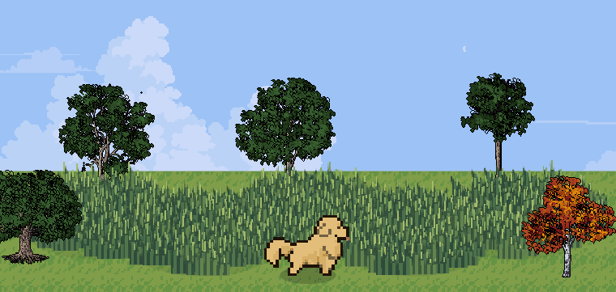
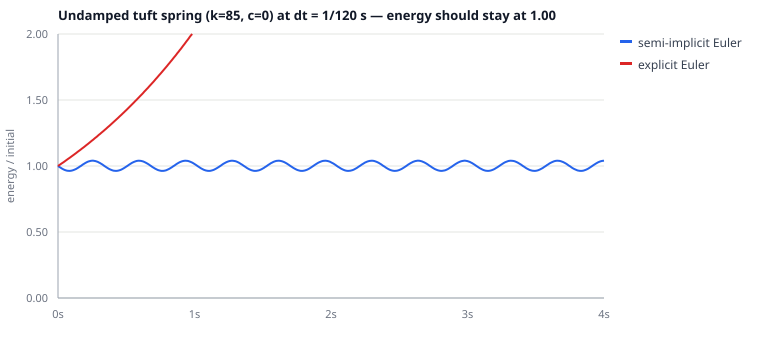

# interactive-physics-sim

A 2D physics simulation built for my [portfolio site](https://royrliu.com/interactive.html). A dog walks through a procedurally generated field, bending grass, kicking up particles, and navigating around trees — all running in real time in the browser on a single `<canvas>`.

**[Try it on my website →](https://royrliu.com/interactive.html)**



## What this project demonstrates

- Fixed-timestep game loop with semi-implicit Euler integration
- Damped-spring dynamics for grass deformation
- Particle system with gravity, drag, and lifetime management
- Acceleration-based character movement (not position-snapping)
- Spatial reasoning about when detailed physics matters and when cheap approximations are visually indistinguishable
- Seeded, reproducible world generation
- Benchmarks that check the performance and stability claims instead of asserting them

## How the physics works

### Dog movement

The dog accelerates toward its target rather than teleporting to the cursor. Distance determines acceleration magnitude; a dead zone near the target lets it come to rest naturally. Velocity is capped so distant clicks don't produce unrealistic speed. The result feels like an invisible leash — the cursor leads, the dog follows with inertia.

### Grass as damped springs

Each tuft stays rooted in place. Only its visual bend is simulated. When the dog passes through, bend velocity is added in the contact direction. Afterward, the tuft follows a standard spring-and-damper model:

```
a = −k·x − c·v
```

where `x` is the bend displacement, `v` is bend velocity, `k` controls stiffness, and `c` controls damping. This is the model described in [Glenn Fiedler's Spring Physics](https://gafferongames.com/post/spring_physics/), applied per-tuft rather than per-blade — one spring represents the visible deformation of an entire tuft.

### Particles

Loose grass bits use a separate particle system. Each particle has position and velocity, with gravity pulling it down and drag reducing speed over time. Particles have short lifetimes and fade on settling. The system is capped at 320 particles, and there are no particle–particle collisions — pairwise detection would scale quadratically for details that aren't visible at this draw size.

### Integration

Physics runs at a fixed timestep of `1/120 s` using semi-implicit Euler: acceleration updates velocity first, then the new velocity updates position. This is more stable than explicit Euler for spring systems and decouples the simulation from the display refresh rate. Accumulated catch-up time is capped at `0.1 s` to prevent a slow frame from creating a feedback loop.

This follows the approach in [Fix Your Timestep!](https://gafferongames.com/post/fix_your_timestep/) by Glenn Fiedler.

### Collisions

Trees use circular footprints — enough to steer the dog around trunks without per-pixel sprite tests. Project objects use simple proximity checks. These approximations are intentional: detailed geometry where it changes how the scene feels, cheap tests where the result is visually indistinguishable.

## Performance decisions

- Terrain and small grass sprites are cached, not redrawn every frame.
- Rooted grass is sorted once at generation time; each frame merges that static ordering with the small set of moving objects.
- Per-tuft state instead of per-blade keeps the spring simulation O(n) in tuft count.
- The dog-contact test runs inside the same pass the spring update already needs, so there is no second traversal and no spatial index to maintain — at these counts a uniform grid would cost more than it saves.
- Particles are integrated and compacted in one pass, overwriting in place rather than allocating a new array every step.
- No particle–particle collisions, no airflow simulation, no articulated skeleton — these would add cost without visible improvement at this scale.

The goal was to preserve the dynamics a viewer actually notices (inertia, spring recovery, gravity, drag) while keeping computation small enough for a smooth interactive webpage.

### Measured

`bench/frame-bench.html` times the real `updatePhysics` against synthetic tuft
and particle counts. At 120 Hz the budget is **8.33 ms per step**. A live scene
holds 363 tufts at 760×470 and 1780 at 1920×1080, so the range below brackets
real usage.

| tufts | physics ms/step | % of step budget |
| ---: | ---: | ---: |
| 250 | 0.008 | 0.1% |
| 500 | 0.010 | 0.1% |
| 1000 | 0.015 | 0.2% |
| 2000 | 0.032 | 0.4% |
| 4000 | 0.065 | 0.8% |

Cost doubles as tuft count doubles, which is the O(n) claim above holding up.
Running with the particle system saturated at its 320 cap moves these numbers by
less than a microsecond — the springs dominate.

Median of 220 batched samples, headless Chromium 153 under WSL2. The harness
also reports draw time, but that machine has no GPU and falls back to software
rasterisation, so those figures say more about SwiftShader than about the
renderer; measure them in a real browser.

## Integration, measured

The claim that semi-implicit Euler is the right choice here is worth checking
rather than asserting. `bench/integrator.mjs` runs both integrators over the
same force law and the same `k` the grass uses:

```bash
node bench/integrator.mjs
```



With damping removed so the exact solution conserves energy, any drift is the
integrator's own error. After 4 s at `dt = 1/120 s`, semi-implicit Euler holds
total energy at **1.04×** its initial value, oscillating within a bounded band —
it does not conserve energy exactly, but the error never accumulates. Explicit
Euler reaches **16.9×** and is still climbing.

The gap widens fast as the step grows:

| timestep | semi-implicit | explicit |
| --- | ---: | ---: |
| 1/480 s | 1.010 | 2.03 |
| 1/240 s | 1.020 | 4.12 |
| 1/120 s | 1.040 | 16.9 |
| 1/60 s | 1.083 | 271 |
| 1/30 s | 1.171 | 5.05 × 10⁴ |
| 1/15 s | 1.144 | 2.24 × 10⁸ |

With the real damping (`c = 11`) explicit Euler does not visibly explode at
1/120 s, because the damping term bleeds off energy faster than the integrator
adds it. That is the trap: it looks fine until the timestep slips or someone
stiffens the spring. Semi-implicit costs exactly the same per step.

## What isn't simulated

This is deliberately a perceptual model, not a physically complete one. There is no airflow, blade-level grass mechanics, leaf deformation, articulated dog skeleton, or physical lighting. Some effects are exaggerated because physically accurate motion is too subtle to read at this scale.

## Determinism

The scene is generated from a seeded PRNG (mulberry32), so a world can be
reproduced, linked to, and benchmarked:

```
http://localhost:8000/interactive.html?seed=12345
```

Without `?seed` a random seed is chosen and logged to the console. The world is
rebuilt from the seed on every resize, so runtime randomness — particle bursts,
sprite frames — can never shift the layout out from under you.

## Running locally

```bash
# clone and serve — no build step, no dependencies
git clone https://github.com/royliu897/interactive-physics-sim.git
cd interactive-physics-sim
python3 -m http.server 8000
# open http://localhost:8000
```

ES modules need a real origin, so `file://` will not work.

```bash
node bench/integrator.mjs           # integrator comparison, writes docs/
# then open http://localhost:8000/bench/frame-bench.html for frame timings
```

## Project layout

```
src/
  config.js       constants shared by the page and the benchmarks
  rng.js          seeded PRNG (mulberry32)
  spring.js       damped-spring force law and both integrators
  state.js        shared mutable simulation state
  grass.js        tuft generation, sprites, and the spring update
  particles.js    emission, integration, in-place compaction
  trees.js        stratified placement, steering, collision response
  dog.js          acceleration-based movement
  world.js        world generation
  simulation.js   one fixed physics step
  render.js       all drawing
  input.js        pointer, keyboard, window events
  ui.js           pause, found counter, encounter panel
  notes.js        the "About the simulation" dialog
  main.js         entry point and the fixed-timestep loop
bench/            frame timings and the integrator comparison
docs/             generated charts
```

`spring.js` has no DOM or canvas dependency, which is what lets the benchmark
exercise the exact force law the page runs.

## Artwork credits

Ground tiles from [Beast's Overworld — Grass Biome](https://opengameart.org/content/overworld-grass-biome) (CC0). Bending grass tufts are drawn in code. Dog, trees, and other sprites are original artwork.

## Contact

Roy Liu · [royrliu@utexas.edu](mailto:royrliu@utexas.edu) · [royrliu.com](https://royrliu.com)
